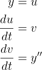
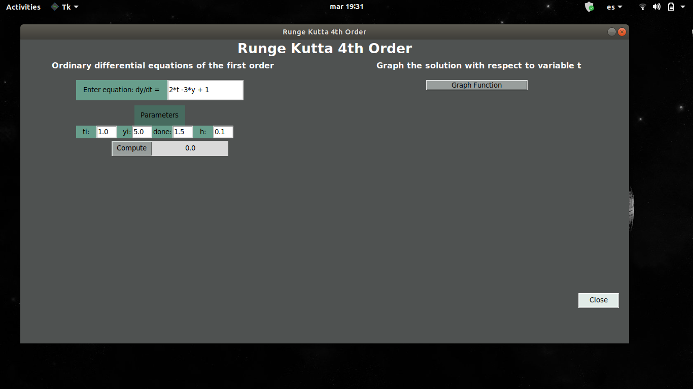
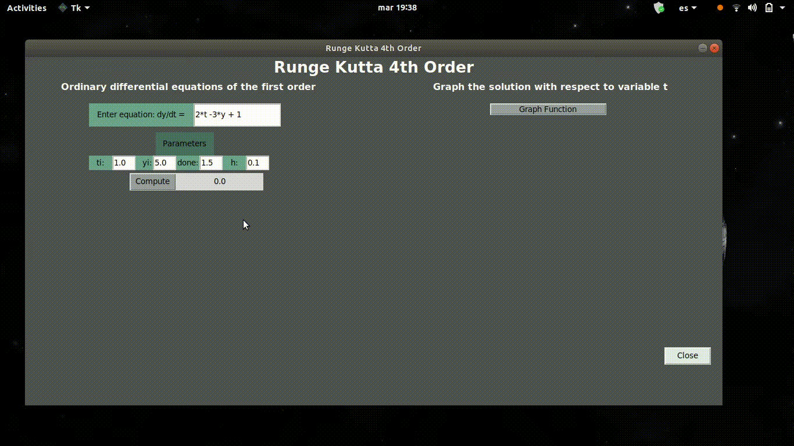

<p align="center"></p>

## Runge-Kutta4

[](../master/LICENSE) 

Fourth-order Runge Kutta method to solve ordinary differential equations (ODE's) given the initial conditions of the equation, to obtain the solution. The implementation can resolve first and second order ODEs.

To solve the second order ODE's can be decomposed into a system of differential equations, as shown below.
<p align="left"></p>

## Installation
<!-- ```sh
$ python -m pip install git+https://github.com/JCLArriaga5/Runge-Kutta4.git
``` -->
Clone repository
```sh
$ git clone https://github.com/JCLArriaga5/Runge-Kutta4.git
```
Enter the path where the repository was cloned and install the dependencies with the following command:
```sh
pip install -r requirements.txt
```
First check if you have [tkinter](https://docs.python.org/3.6/library/tkinter.html) installed, the GUI needs tkinter to run, use the following command to install tkinter:
```sh
sudo apt-get install python3-tk
```

## Examples
For examples of how to use the functions see this [file](../master/examples/test.py), run the test:
```sh
:~/Runge-Kutta4$ cd examples/
:~/Runge-Kutta4/examples$ python test.py
```

## GUI for first-order ODE's
<span style="color:red">Note: GUI needs Python 3 or higher</span>


To run the GUI use the following commands inside the path where the repository was cloned
```sh
:~/Runge-Kutta4$ cd RungeKutta/GUI-RK4/
:~/Runge-Kutta4/RungeKutta/GUI-RK4$ python3 GUI.py
```
The following window will open.
<p align="center"></p>

To see the default example, first click on `compute`. To see the solution graph press on the `Graph function` button, so that it is shown as in the following image.

<p align="center"></p>
