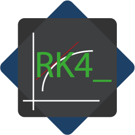
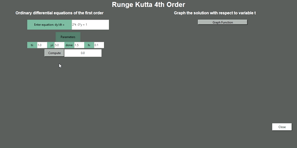

<p align="center"></p>

# Runge-Kutta 4th Order for N-Dimensional ODE Systems

[](../master/LICENSE) 
[](https://www.python.org/)
[](https://www.sympy.org/)

A robust, modern implementation of the Fourth-Order Runge-Kutta (RK4) method in Python. This repository provides a highly optimized backend powered by **NumPy** and **SymPy** that can solve an arbitrary number of $N$-order ordinary differential equations (ODEs), alongside an interactive **Tkinter** GUI with embedded **Matplotlib** graphs.

## 🚀 Key Features

*   **N-Dimensional Support**: Solve anything from a simple 1st-order equation up to complex multi-dimensional systems (e.g. Lotka-Volterra, Lorenz Attractor, Harmonic Oscillators).
*   **Vectorized Backend**: State vectors are handled completely via `numpy.ndarray` for superior performance and compact logic.
*   **SymPy JIT Compilation**: Enter mathematical expressions as strings (like `2 * t - 3 * y[0]`); the core uses SymPy to parse, strictly validate, and efficiently compile them to native Numpy expressions.
*   **Embedded GUI**: A modern Tkinter-based interface that prevents pop-ups by rendering Matplotlib charts directly into the main window canvas.
*   **Strict Validations**: Safely catch syntax errors and unknown variables automatically before execution.
*   **Unit Tested**: Confirmed accuracy via automated `unittest` suites.

## 🛠️ Installation & Setup

1. **Clone the repository**
   ```bash
   git clone https://github.com/JCLArriaga5/Runge-Kutta4.git
   cd Runge-Kutta4
   ```

2. **Install dependencies**
   Make sure you have Python 3 installed. It's recommended to use a virtual environment.
   ```bash
   pip install -r requirements.txt
   ```

3. **Install Tkinter** (Linux/Debian users)
   If you intend to use the GUI, ensure the Tkinter module is present on your system.
   ```bash
   sudo apt-get install python3-tk
   ```

## 💻 Usage Examples

### 1. Programmatic Usage (Python Script)
You can easily import and utilize the `RK4` class in your own scripts.

```python
import numpy as np
from rk4odes.rk4 import RK4

# Example 1: First-Order System
rk_1 = RK4('2 * t - 3 * y + 1')
result_1 = rk_1.solve(ti=1.0, yi=5.0, t=1.5, h=0.01)
print("1st Order Result:", result_1)

# Example 2: Second-Order System (Harmonic Oscillator y'' = -y)
# Decomposed as: y0' = y1, y1' = -y0
rk_2 = RK4(['y[1]', '-y[0]'])
result_2 = rk_2.solve(ti=0.0, yi=[0.0, 1.0], t=np.pi/2, h=0.01)
print("2nd Order Result:", result_2)
```

### 2. Graphical User Interface (GUI)
Launch the graphical app to solve and visualize systems without writing code.

```bash
cd rk4odes/GUI
python3 GUI.py
```

<p align="center"></p>

> *Note: The GUI supports passing multi-line equations in its text area and comma-separated initial values, allowing you to plot multiple interlocked differential curves at once.*

## 🧪 Running Tests

The project includes built-in unit tests verifying numerical accuracy and error handling. You can run them via:

```bash
python3 -m unittest discover -s tests -v
```

## 📝 License

This project is licensed under the MIT License - see the [LICENSE](LICENSE) file for details.
